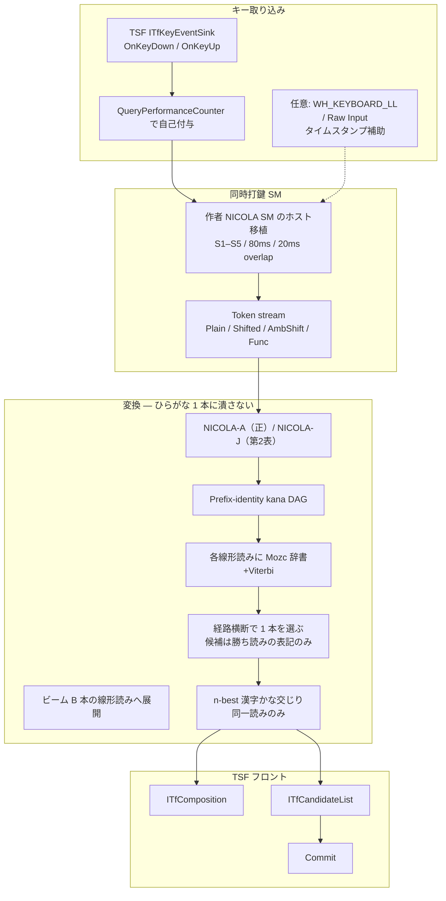
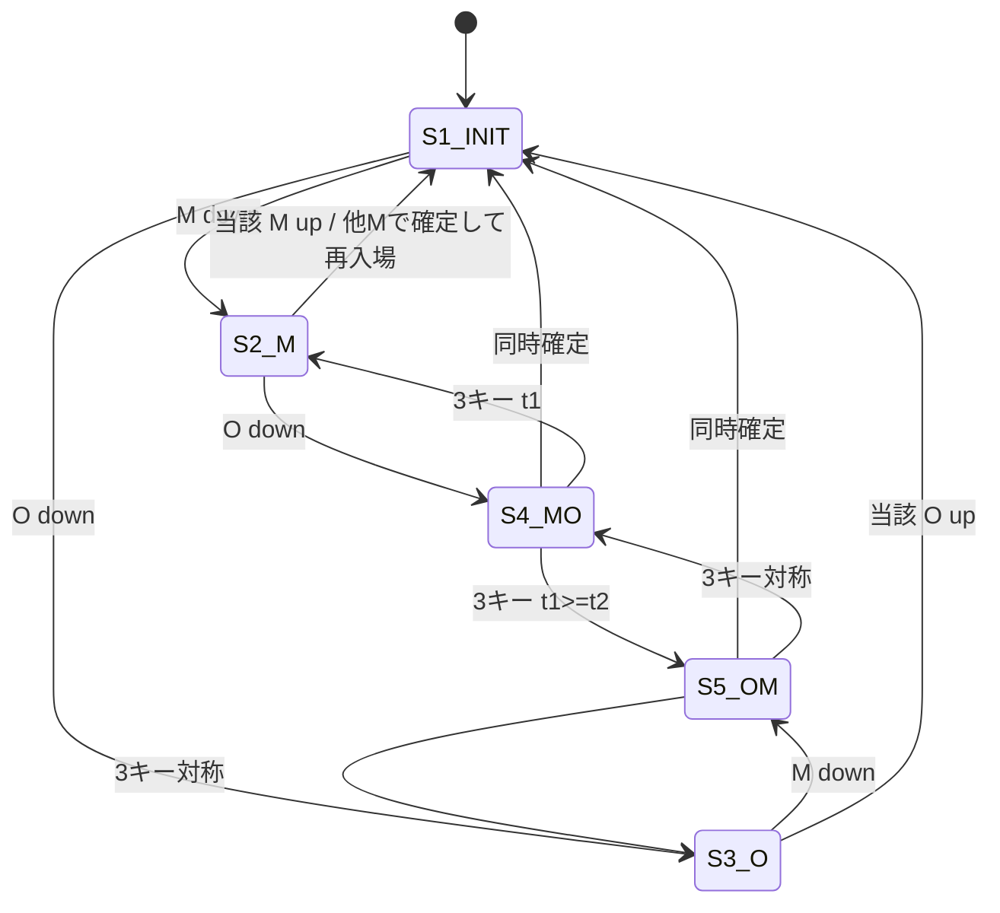
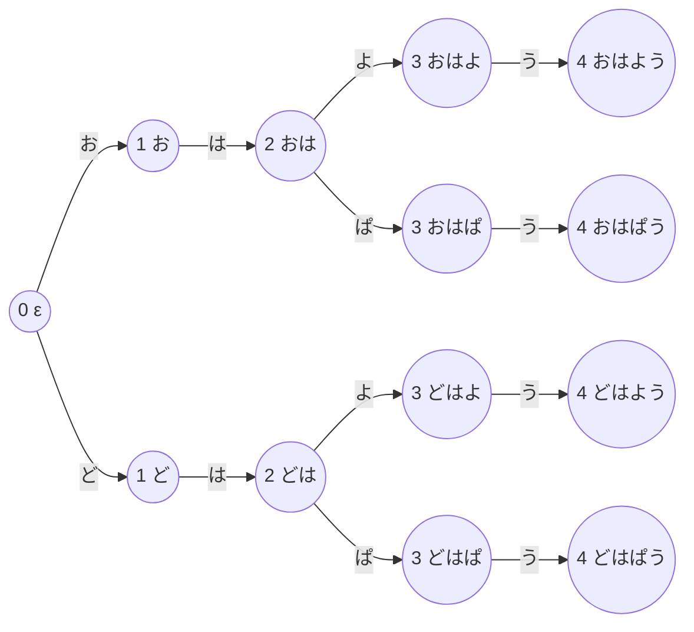

# 左右あいまい親指シフトかな漢字変換 IME 設計書

| 項目 | 内容 |
| --- | --- |
| 文書タイトル | 左右あいまい NICOLA かな漢字変換システムの設計と実装計画 |
| 著者 | 設計メモ（個人プロジェクト） |
| 日付 | 2026-08-16 |
| 状態 | Draft r3。実装の到達点は [STATUS.md](STATUS.md) |
| 対象読者 | 実装する本人、および将来の自分（シニアエンジニア向け） |
| 関連リポジトリ（予定） | `C:\Users\marur\oyayubi-ime` |
| 本ドキュメントの性質 | **調査・設計・計画のみ。実装コードは含めない。** |

---

## Overview

**一言:** 横長スペースバーの一般キーボード（作者の常用は US ANSI 物理 + NICOLA-A）で、左右あいまいな親指シフトを、**普通の Windows IME** として使う。

専用親指キーボードは左右に独立した O キー（親指キー）を持つ。横長スペースバーではその左右を物理的に区別できない。やまぶきR・紅皿・Japanist 快速親指シフトなどは、スペース／無変換／変換に **片方の親指を固定** し、左右を確定させてから既存 IME にひらがなを渡す。これは禁止パイプライン（あいまい打鍵 → 単一ひらがな → 既存かな漢字変換）であり、いったん誤った読みに潰れると使い物にならない。それらは **失敗事例** であって、本 IME の UX 雛形でもランタイム部品でもない。

本プロジェクトはあいまいさを「親指キーの左右不明」だけに限定する。単一 Space と文字の同時打鍵は `AmbShift`（2 面）のままかな格子へ載せ、**打鍵経路 × 単語列を同時に採点** する。1 本の読みに潰して既存 IME に渡すことは禁止する。

再利用スタックは **TSF + Mozc 変換ライブラリ + 作者の NICOLA 仕様** である。同時打鍵 SM は 2000 年規格書から起こし直すのではなく、`C:\Users\marur\qmk_userspace\docs\NICOLA-SPEC.md` をホスト側へ移植する。ファームウェアは物理 2 親指なので確定かな（実際はローマ字 HID）を出す。IME 層で増える仕事は、Space が唯一の O キーのとき `Shifted(Left|Right)` の代わりに `AmbShift` を出すことだけである。タイミング規則は変えない。`nicola.c` は GPL-2.0-or-later なので **コピーせず**、仕様の挙動だけを BSD/MIT クリーンに再実装する。

---

## Background & Motivation

### なぜ今これをやるのか

- 専用親指キーボード実機の新品入手は年々難しい。Japanist も個人向け 2020-09、法人向け 2021-05 で販売終了（[NICOLA 公式一覧](http://nicola.sunicom.co.jp/info3.html)）。
- **製品の前提は横長スペースバー**である。短い JIS スペース＋無変換／変換に届く人向けのエミュレータ運用は、対象の中心ではない。
- 作者の常用は US ANSI 物理 + NICOLA-A。既に QMK 上の NICOLA SM を仕様化・実機確認済み（`qmk_userspace/docs/NICOLA-SPEC.md`）。
- 許容する不確実性は「左右のどちらが押されたか分からないが、どちらかではある」だけ。近接キー誤打・ローマ字ゆらぎ・一般 fuzzy は候補に出さない。

### 現状の痛み

一般キーボードで NICOLA を使う現行手段は、すべて左右を先に確定する。

| 系統 | 代表 | 左右の扱い | 本設計との関係 |
| --- | --- | --- | --- |
| キーリマップ常駐 | やまぶき / やまぶきR、紅皿、DvorakJ、姫踊子草、Q's Nicolatter | スペース／無変換／変換に L または R を固定してから既存 IME へ | **失敗モード。UX 雛形にしない。ランタイムに乗らない** |
| IME 内蔵エミュレータ | Japanist 快速親指シフト | 読みを確定してから変換 | 同上。販売終了 |
| Linux エミュレータ | oyainput | 左右を別 VK に割り当て | 同上。ホスト SM の正本ではない |
| 作者のファームウェア | `qmk_userspace` NICOLA（TS52K 実機確認） | 物理 2 本の O キー → 確定面 | **SM の挙動正本。** IME はこれをホスト移植し、単一 Space だけ AmbShift にする |
| 配列は似て非なるもの | 薙刀式、飛鳥、orz、小梅 | 同時打鍵や親指レイヤを使うが NICOLA ではない | **v1 対象外。混同禁止** |
| 既存大手 IME | MS-IME / ATOK / Google 日本語入力 / Mozc | NICOLA ネイティブ非対応。ローマ字テーブル拡張では同時打鍵も左右あいまいも表現できない | フロントに被せるだけなら禁止パス |

上記エミュレータはいずれも **出力が確定ひらがな 1 文字** であり、既存 IME に渡す。それが禁止アーキテクチャである。やまぶきR の百分率判定や紅皿の零遅延＋BS 書き換えは、本 IME の実装契約ではない。タイミングの正本は作者仕様（TIMEOUT 80 ms、OVERLAP 20 ms）である。

### 禁止アーキテクチャ（最初に排除する）

```
[あいまい打鍵列] → (左右を推測 or 固定) → [単一ひらがな] → MS-IME / ATOK / Google IME / Mozc
```

失敗の具体例は後述の「おはよう / どうぞ」ワークド例を見よ。読みを 1 本に潰した瞬間、後段 IME は「その読みとして尤もらしい漢字」を探すだけで、「同じ打鍵から生まれた別読み」との競争が消える。n-best ひらがなを既存 IME に順送りしても、IME はそれらを独立クエリとして扱い、候補窓がゴミで埋まる。

---

## Goals & Non-Goals

### Goals

1. 横長スペースバー 1 本の一般キーボードで、NICOLA 同時打鍵を実用速度で打てる。作者の日次・評価の正は **US ANSI 物理 + NICOLA-A**。JIS 用 NICOLA-J は **同じ FSM・同じ変換器に載せる第 2 テーブル**であり、コンバータを分岐させない。JIS を品質第一にはしない。
2. スペース＋文字のコードは **左右未定の 2 値トークン** として残し、かな漢字変換の最終スコアまで潰さない。
3. 第一候補は、意図した文（例: 「おはよう」「どうぞ」）が日常文で安定して出る。
4. あいまいさは左右のみ。近接キー誤打・ローマ字・一般 typo はモデルにも候補にも出さない。
5. Windows 10/11 で **普通の日本語 IME**（MS-IME / Google 日本語入力と同じ打ち心地）として動く。独自の親指専用スペース運用はしない。かな composition 中の Space は変換。英数モードの Space は空白。
6. 一人の経験ある開発者が、オフライン試作 → 日次利用、まで到達できる規模に抑える。
7. 再利用は **TSF + Mozc 変換ライブラリ + `NICOLA-SPEC.md`**。stock mozc_server にも外部キーボードソフトにも乗せない。

### Non-Goals（v1 でやらない）

- ローマ字入力、AZIK/ACT、新 JIS、JIS かな配列、Flick、TUT-code / T-Code
- 薙刀式・飛鳥・orz・小梅（配列テーブル差し替えはデータ上可能でも v1 対象外）
- 左右両方の親指同時（物理 1 キーでは表現不能。作者仕様も `S6_OO` 廃止済み）
- エンドツーエンドニューラル変換を最初から作ること
- Microsoft Store 配布、企業向け署名付きインストーラ（個人サイドロードが v1）
- クラウド同期学習、オンライン辞書更新
- タッチキーボード最適化レイアウトの自作
- Linux / macOS 先行
- 専用親指キーボード実機の VID/PID 自動検出。2 本の親指キーがある板は、設定で既知 L/R に割り当てる。Plug-and-Play は v1 に無い
- やまぶきR / 紅皿 / AutoHotkey / oyainput をランタイムに置くこと
- 「Space は常に親指専用で、変換は別キー」という独自 UX
- F7–F10 文字種変換、リアルタイム予測、部分確定サジェスト、文節リサイズ（v1 カット。Key Decision 15）

### あいまいさの境界（厳守）

| 入力の不確実性 | v1 |
| --- | --- |
| スペースが左親指か右親指か不明 | **許容。格子に 2 枝を残す** |
| ユーザが設定で 2 キーを既知 L/R に割り当てた | あいまいさ 0。`Shifted` 1 枝 |
| 隣接キー誤打（j のつもりが k） | **禁止。候補に出さない** |
| ローマ字の n'/nn/ん ゆらぎ | 対象外（ローマ字自体が非ゴール） |
| シフト窓の内外（同時か単独か） | ステートマシンが **決定的に** 判定。あいまいトークンにしない |

---

## Proposed Design

### 全体像



### 層の責務

| 層 | 役割 | 自作 / 再利用 |
| --- | --- | --- |
| キー取り込み | down/up と µs 級タイムスタンプ | TSF コールバックで QPC。不足時のみ LL hook |
| Chord FSM | 作者 NICOLA SM のホスト移植（仮想時計・単体テスト） | 仕様は `NICOLA-SPEC.md`。**`nicola.c` はコピーしない**（GPL-2.0-or-later） |
| Token | あいまいさを明示した中間表現 | 自作。小さい代数的データ型 |
| NICOLA table | 1 キー 3 面マップ | データ。正は NICOLA-A（`nicola_table.c` の割当を仕様として写す）。NICOLA-J は第 2 ファイル |
| Kana lattice | トークン列 → prefix-identity DAG | 自作。**内部表現。ユーザーには見せない** |
| Path expander | DAG → ビーム B 本の線形ひらがな | 自作。Mozc `LookupPrefix` はここより後の線形 key にだけ使う |
| Word lattice + LM | 各線形読み上の単語 Viterbi | Mozc **辞書・Connector・ImmutableConverter をライブラリとしてリンク**。stock `mozc_server` は呼ばない |
| TSF UI | composition / 候補 / 確定 | **自前の小さい `oyayubi_tip`。** SampleIME の fail-open |
| 学習・ユーザ辞書 | 確定履歴 | 確定経路のかな + `amb_choice`。Mozc UserDictionary 形式を流用可 |

### トークン代数（変換エンジンが受け取るもの）

Chord FSM は「かな」を出さない。出すのは次のトークンだけである。

```text
KeyId        = 物理位置（VK ではなくスキャンコードまたは QWERTY 位置 ID）
Thumb        = Left | Right | Unknown
Face         = Plain | Same | Cross                    -- テーブル面。ShiftKind は使わない

Token
  = Plain      { key: KeyId }                          -- 単独確定
  | Shifted    { key: KeyId, thumb: Left | Right }     -- 左右既知の同時打鍵
  | AmbShift   { key: KeyId }                          -- スペース等、左右不明の同時打鍵
  | ThumbTap   { thumb: Left | Right | Unknown }       -- 親指単独（変換/無変換/空白）
  | Func       { name: Convert | Commit | Backspace }
```

`AmbShift(J)` は「お」でも「ど」でもない。マッピングは次の層が行う。使わない面（テーブルが空）は枝を作らない。

### NICOLA 同時打鍵ステートマシン

**挙動の正本は作者仕様** [`C:\Users\marur\qmk_userspace\docs\NICOLA-SPEC.md`](C:\Users\marur\qmk_userspace\docs\NICOLA-SPEC.md)（2026-08-11 書き直し済み、TS52K 実機確認、`users/nicola/nicola.c` と対）。WP1 はこれをホスト側・仮想時計・単体テスト可能なモジュールへ **移植** する作業である。2000 年 NICOLA 配列規格書や紅皿／hoboNicola のフォークロアから起こし直さない。

規格書は「50–200 ms が実験的に妥当、例 100 ms」と書く。作者の動いている値は:

```text
TIMEOUT_THRESHOLD = 80 ms    // 同時とみなす最大間隔
OVERLAP_THRESHOLD = 20 ms    // まだ結合の余地あり、とみなす重なり
```

IME 既定も 80 / 20。変更するなら設定項目にする。タイミング規則自体はファームウェアと同一。

#### ファームウェアと IME の差分（ここだけが新しい）

| | QMK（物理 2 親指） | 本 IME（横長スペース 1 本） |
| --- | --- | --- |
| 入力 | press / release（`register`/`unregister`。`tap_code` 禁止） | 同じ代数。TSF の down/up + QPC |
| O キー | `NG_SHFTL` / `NG_SHFTR` | 既定は **Space 1 本 = 左右不明の O** |
| 同時打鍵の出力 | 確定面のかな（実装はローマ字 HID） | `Shifted` または **`AmbShift`** |
| ゲート | keymap がかなモード時だけ SM に入れる | TSF シェルがかな／英数を決める。英数では SM に入れない |
| 修飾 | 押下中は NICOLA レイヤ off → 素の QWERTY（Ctrl+C） | 同じ。修飾中は SM を通さずキーを素通し |
| タイムアウト | **状態を変えない。** 保留出力を press するだけ | **状態を変えない。** 未出力ならトークンを 1 回 emit |
| `S6_OO` | 廃止済み | 廃止のまま。両親指は表現しない |

GPL 注意: `nicola.c` / `nicola_table.c` は GPL-2.0-or-later。IME リポジトリへコピーしない。テーブルの **かな割当** は仕様として TOML に書き起こす（NICOLA 規格の文字であり著作物としての C ソースは持ち込まない）。

#### 状態（仕様 §4。S6 は無い）

| 状態 | 意味 |
| --- | --- |
| `S1_INIT` | 待機。保留なし |
| `S2_M` | 文字キー M を 1 つ保留 |
| `S3_O` | 親指 O を 1 つ保留 |
| `S4_MO` | M→O。同時打鍵候補 |
| `S5_OM` | O→M。同時打鍵候補 |



割り込み／タイムアウトは上図の矢印にしない（状態据え置き）。詳細は仕様 §4-1〜§4-4。PR-02 の合格は仕様の遷移表を仮想 ms でなぞる golden であり、この mermaid ではない。

3 キー（仕様の `t1`/`t2`）:

- `S4_MO` で次の M: `t1 = o_time - m_time`、`t2 = now - o_time`。`t1 < t2` なら前の MO を確定、`t1 >= t2` なら先頭 M 単独＋今の M と O を `S5_OM`。
- 解放で `t2 < OVERLAP_THRESHOLD (20 ms)` なら「まだ後続と結合する余地」として先のキーだけ確定し一段戻す。

#### FSM I/O 仕様（WP1 / PR-02 の契約）

| イベント | フィールド | 本番の発生源 |
| --- | --- | --- |
| `Down` | `key`（M / O / その他）, `qpc` | `OnKeyDown` + QPC |
| `Up` | `key`, `qpc` | `OnKeyUp` + QPC |
| `Timeout` | `deadline_qpc` | message-only HWND の `SetTimer`（80 ms）。TSF は飛ばない |

ホストでの出力写像（ファームウェアの `m_press` / `om_press` / `*_release` に対応）:

- まだ emit していなければトークンを 1 回出す。release 時に既に timeout で出していれば追加 emit しない。
- 単一 Space が O のとき、MO/OM 同時は常に `AmbShift(M)`。2 キーを既知 L/R に設定したときだけ `Shifted`。
- O 単独確定（`S3_O` の当該 O up、または timeout 後の release）→ `ThumbTap`。**かなをここで決めない。**

編集モデル（IME 側。Composer は使わない）:

| 操作 | 意味 |
| --- | --- |
| トークン確定 | 格子の末尾に `extend` |
| `Backspace` | 最後のトークンを pop |
| Convert / Commit | TSF シェル。後述 |
| 途中編集 | v1 非対応（常に末尾） |
| 空 composition の Backspace | Eat せずアプリへ |

空面: テーブルに無い面は辺を作らない。NICOLA-A の `nicola_table_shftr` に NG_Q / NG_Z が無い等はデータどおり。

仮表示（常に 1 文字列。SendInput+BS は使わない）:

- M down 直後（未確定）: 単独面（J→と）
- トークン確定後: **ジョイント 1-best**（ビーム）。AmbShift の面を同側に固定しない
- 同側固定はしない。クロスシフトは Plain の濁点（または半濁）であり、同側だけ出すのは日本語から濁音を消すことと同じ

#### Space の役割（普通の IME。エミュレータ慣習ではない）

SM は Space を **左右不明の O キー** として見る。シェルがトークンを IME 操作に落とす。

| 状況 | SM の出力 | シェル |
| --- | --- | --- |
| Space＋文字が同時 | `AmbShift(文字)` | 格子に載せる |
| かな composition 中の Space 単独 | `ThumbTap(Unknown)` | **変換**（MS-IME / Google 日本語入力と同じ） |
| 英数モードの Space | SM に入れない | **空白** |
| composition が空のかなモードで Space 単独 | `ThumbTap(Unknown)` | 空白 |

「Space は常に親指専用で、変換は別キー」は **却下した独自 UX**。v1 の選択肢にしない。

修飾: 押下中は NICOLA ゲートを閉じ、Ctrl+C 等は QWERTY のまま通す（仕様 ゲート2）。英数モードもゲート1 相当で SM に入れない。

### かな格子（不変条件）

**v1 の格子セマンティクスは prefix-identity DAG である。トークン位置だけでマージしない。**

```text
不変条件:
  ノード ID = (token_index, prefix_id)
  prefix_id は start からそのノードまでのひらがな列の完全一致で決まる。
  辺は 1 トークン・1 面・ひらがな 0 または 1 文字（空面は辺を作らない）。
  2 本の入辺がマージされるのは、到着ひらがな列がバイト列として同一のときに限る。
  したがって「おは」と「どは」は別ノードである。共有される「は」ノードは存在しない。
```

トークンからの展開:

```text
AmbShift(key) => 空でない面ごとに 1 辺（通常 Same と Cross。B は Same のみ）
Plain(key)    => Plain 面が空でなければ 1 辺
Shifted(...)  => 指定面が空でなければ 1 辺
```

- ここで argmax しない。
- v1 の経路 prior: 全生存枝を等コスト（0）。
- 将来オプション: 自己申告の利き親指は **タイブレーク専用**。候補フィルタに使わない。
- start ノードは `(0, ε)`。end は `token_index == n` の全ノード。
- `token_index` はトークン境界に揃う。同じ `token_index` のノードは「同じ打鍵数を消費した別読み」。

おはよう 4 経路のノード（「は」は共有しない）:

```text
(0,ε)
  ├─お→ (1,お) ─は→ (2,おは) ─┬─よ→ (3,おはよ) ─う→ (4,おはよう)
  │                          └─ぱ→ (3,おはぱ) ─う→ (4,おはぱう)
  └─ど→ (1,ど) ─は→ (2,どは) ─┬─よ→ (3,どはよ) ─う→ (4,どはよう)
                             └─ぱ→ (3,どはぱ) ─う→ (4,どはぱう)
```

ゴールデンテスト（PR-04）: 単語「おはよう」（start から end の おはよう 枝を全スパン）と、ど枝上の任意単語を **同時に** 格子へ載せられる。位置共有 Viterbi（中間「は」で履歴を 1 本に潰す）ではこのテストは落ちる。

メモリ: 層あたり高々ビーム B 個の異なる prefix。32 トークン × B=16 で最悪 ~512 ノード。旧稿の「~48」は位置マージ前提だったので破棄する。

### 単語格子とジョイントスコア

```text
score(reading, words) = Σ word_cost + Σ connect_cost(pos_i, pos_{i+1})
                      + Σ path_prior(kana_edge)
                      + user_history_bonus
```

Mozc の現状（検証済み。実装が依存してよい事実）:

- `mozc::composer` はキーボード → **単一ひらがな列**（[composer/README.md](https://github.com/google/mozc/blob/master/src/composer/README.md)）。
- `ConverterInterface::StartConversion(ConversionRequest, Segments*)` は **単一 `key_` 文字列**（[converter_interface.h](https://github.com/google/mozc/blob/master/src/converter/converter_interface.h)）。
- `SystemDictionary::LookupPrefix(absl::string_view key, Callback*)` は **線形な残り key**。DAG ノードからは呼べない。
- `mozc::Lattice::begin_nodes(pos)` は一意な `key_` の **バイトオフセット**。
- `KeyCorrector` は typo 補正。v1 では **無効**。
- `ConversionRequest::IsKanaModifierInsensitiveConversion()` は か/が 同一視。左右親指ではない。**v1 ではオフ**。

したがって「Mozc にかな DAG を渡す API」は **無い**。`LookupPrefix` も `begin_nodes` も DAG には適用しない。

**Phase 1（必達、WP3）: ビーム展開 + 線形 Mozc。既定アルゴリズム。**

1. prefix-identity DAG をビーム幅 B（既定 16、上限 `PathExpandMax` 既定 32）で展開し、生存読みを **線形ひらがな文字列** の集合にする。v1 の経路 prior は 0 なので、超過分は安定なタイブレークで落とす。
2. 各線形読み `r` に対し、Mozc を **その文字列だけ** に適用する。
   - 既定: リンクした `ImmutableConverter` / `StartConversion` を `key=r` で呼ぶ。コスト尺度は Mozc ネイティブのまま（同一 Connector なので経路間で直接比較してよい。再正規化しない）。
   - 辞書だけの縮退: `LookupPrefix(r.substr(pos))` を線形 `r` の各バイト位置から。
3. 経路横断で `score(r, words_r)` が最小の **勝ち読み `r*`** を 1 本選ぶ。
4. **候補はジョイント n-best の漢字かな交じり**（既読／記憶、おはよう／お早う）。読みに左右ラベルは付けない。スコアが悪い非語経路（どはよう）は載せない。1-best は会話ならどうぞであり、王族は下位に出てもよい（選ばれたら学習する）。
5. 手順 2 を採点のために複数回呼ぶことは許す。stock `mozc_server` に複数 key を投げて候補をマージすることは **禁止**。

手順 2–4 は真のジョイント Viterbi の近似である（読みごとに独立デコードしてから min）。v1 が約束するのは「勝ち読み以外を UI に出さない」ことと、「おはよう / どうぞが 1-best 読みになる」こと。DAG 上で単語を共有するトークンパッシングは Phase 2。

**Phase 2（任意）: prefix-identity DAG 上の自前トークンパッシング**

状態は `(node, last_POS [, prefix beam])`。単語はノード列上のパス。Mozc の `begin_nodes[pos]` は使わない。Phase 1 が日次可能になってから。

**やってはいけない再利用**

```text
argmax_kana(lattice) → mozc.StartConversion(そのひらがな) を 1 回   # 禁止
各経路の n-best を ITfCandidateList にマージ                       # 禁止（王族リーク）
やまぶきR で左右固定 → 既存 IME                                    # 禁止
ローマ字テーブルに「j+space = お」を書く                            # 同時打鍵も格子も消える
stock mozc_server に複数 key を投げて未フィルタマージ              # 禁止
```

### ワークド例 1: 「おはよう」（ユーザー例。NICOLA-A / NICOLA-J とも同じ面）

ユーザーの打鍵意図:

> 右親指+J → H → 右親指+Y → A

作者テーブル（`nicola_table.c`）および規格ホーム段:

| 打鍵 | 単独 | 同側親指 | 反対親指 |
| --- | --- | --- | --- |
| J | と | **お** | **ど** |
| H | **は** | み | ば |
| Y | ら | **よ** | **ぱ** |
| A | **う** | を | ゔ |

一般キーボード（スペース＝ Unknown 親指）:

```text
AmbShift(J)  Plain(H)  AmbShift(Y)  Plain(A)
     │           │          │           │
     ├─ お ──────は ──┬─ よ ──────う     => おはよう
     │                └─ ぱ ──────う     => おはぱう
     └─ ど ──────は ──┬─ よ ──────う     => どはよう
                      └─ ぱ ──────う     => どはぱう
```



単語 lookup（概念）:

- `おはよう` … 感動詞として辞書に高頻度。1 形態素または お+はよう。コスト低い。
- `どはよう` … 「ど / は / よう」とバラバラ。接続コスト過大。単語「どはよう」は無い。
- `おはぱう` / `どはぱう` … 同様に形態素が繋がらない。

経路横断採点は勝ち読み「おはよう」を返す。候補に載せるのは **その読みの表記ゆれだけ**（おはよう / お早う / 御早う）。どはよう / おはぱう / どはぱうの Mozc 出力は、スコア比較のあと **破棄** する。閾値は「勝ち読み以外は載せない」（相対閾値ではなく勝ち 1 本）。ユーザーは左右を選ばない。

なぜ「n-best ひらがな → 既存 IME」がダメか（この例でも）:

1. 第一ひらがなを greedy に選ぶと、運良く「おはよう」になることがある（「お」は「ど」より単独頻度が高い）。これは偶然である。
2. 4 本を Mozc に独立投入すると、`どはよう` →「度は用」「土は陽」、`おはぱう` → 意味不明の単漢字列、が候補に混ざる。IME は「同じキーである」ことを知らない。
3. ユーザーは候補窓で表記を選ぶのであって、**打鍵の左右を選ばされる UI にしてはならない**。左右は内部変数のまま消す。

### ワークド例 2: 「どうぞ」—— 潰すと壊れる例

意図: 左親指+J、A、左親指+M（どうぞ）。

| 打鍵 | 同側 | 反対 |
| --- | --- | --- |
| J | お | **ど** |
| A | **う** | — |
| M | ゆ | **ぞ**（M 単独は そ） |

スペースあいまい:

- `AmbShift(J) Plain(A) AmbShift(M)` → おうゆ / おうぞ / どうゆ / **どうぞ** / （M の同側は ゆ、反対は ぞ。領域は右なので同側＝右親指＝ゆ、反対＝左＝ぞ）

独立に最頻面を取ると J は「お」、M は「ゆ」または「そ」になり **「おうゆ」「おうぞ」** になりやすい。「おうぞ」を既存 IME に渡すと「王族」「翁」などが立ち、**「どうぞ」は候補の遥か下か、無い**。

ジョイントモデルでは `どうぞ` が辞書の副詞・感動詞として低コストなので勝つ。これが「格子のまま単語まで持っていく」理由の全部である。

### 仮表示と Convert ポリシー（v1 で固定）

未変換下線と変換キーは **別物** である。キーごとに Mozc Viterbi を 16 ms で回すことは約束しない。

| 時点 | composition 文字列 | デコーダ |
| --- | --- | --- |
| 文字 down（コード未成立） | 単独面（J→と） | なし |
| トークン確定直後 | ジョイント 1-best（読みまたは表記） | ビームは数 ms。同側固定はしない |
| Convert（かな composition 中の Space 単独 = 普通の IME の変換） | 同じデコーダの勝ち読み表記。候補窓を開く | 目標 < 30 ms |
| 候補窓 | ジョイント n-best の表記。既読と記憶なら両方 | 左右ラベルなし。非語の読みは出さない |
| Commit | 選んだ表記。学習に残す読みは **勝ち経路のかな** | |

コード確定時に同側面だけ出す案は却下。クロス＝ Plain の濁点なので、同側固定は「日本語に濁音がない」と仮定することになる。

### NICOLA キーマップ抜粋（NICOLA-A が正）

物理配列と変換器は独立する。**ゴールデンテーブルは NICOLA-A**（US ANSI 物理。`;` `'` `[` `]` `\` の位置は作者の `nicola_table.c` に従う）。NICOLA-J は同じ 3 面モデルの第 2 ファイルで、FSM も格子も変えない。

おはよう／どうぞに使う J/H/Y/A/M の 3 面は、NICOLA-A（`nicola_table_tap` / `_shftl` / `_shftr`）と NICOLA-J（規格 §4・道場）で一致する。

| 物理キー | 単独 (tap) | 左親指 (shftl) | 右親指 (shftr) | 領域 |
| --- | --- | --- | --- | --- |
| J | と | ど | **お** | 右 |
| H | **は** | ば | み | 右 |
| Y | ら | ぱ | **よ** | 右 |
| A | **う** | を | ゔ | 左 |
| M | そ | ぞ | ゆ | 右 |

AmbShift は左右不明なので J → {お, ど}、Y → {よ, ぱ}。意図「右+J, H, 右+Y, A」の 4 経路は両テーブルで同じ。

出典: 作者 `users/nicola/nicola_table.c`（割当は NICOLA 規格。GPL ソースはコピーしない）、[規格書 §3–4](http://nicola.sunicom.co.jp/spec/kikaku.htm)。§5.1 の C06=ぱ 例で H を上書きしない。

以下はホーム段の抜粋（NICOLA-A = ゴールデン）。同側＝その手の親指面。

ホーム段（C 段）:

| QWERTY | 単独 | 同側親指 | 反対親指 |
| --- | --- | --- | --- |
| A | う | を | ゔ |
| S | し | あ | じ |
| D | て | な | で |
| F | け | ゅ | げ |
| G | せ | も | ぜ |
| H | は | み | ば |
| J | と | お | ど |
| K | き | の | ぎ |
| L | い | ょ | ぽ |
| ; | ん | っ | ぱ |

上段（D 段、抜粋）:

| QWERTY | 単独 | 同側 | 反対 |
| --- | --- | --- | --- |
| Q | 。 | ぁ | ゜ |
| W | か | え | が |
| E | た | り | だ |
| R | こ | ゃ | ご |
| T | さ | れ | ざ |
| Y | ら | よ | ぱ |
| U | ち | に | ぢ |
| I | く | る | ぐ |
| O | つ | ま | づ |
| P | ， | ぇ | ぴ |

下段（B 段、抜粋）:

| QWERTY | 単独 | 同側 | 反対 |
| --- | --- | --- | --- |
| Z | ． | ぅ | び |
| X | ひ | ー | ず |
| C | す | ろ | ぶ |
| V | ふ | や | べ |
| B | へ | ぃ | （なし） |
| N | め | ぬ | ぷ |
| M | そ | ゆ | ぞ |
| , | ね | む | ぺ |
| . | ほ | わ | ぼ |
| / | ・ | ぉ | ゛ |

領域: A–G, Z–B が左。H–;, Y–P, N–/ が右。同側＝その領域側の親指。半濁音は規格どおり、濁音を持たないキーのクロスシフトに置く（ら→ぱ、い→ぽ 等）。

実装データは `data/nicola_a.toml`（正）と `data/nicola_j.toml`（第 2）。エンジンはテーブル名を設定で切り替えるだけ。空面は欠測として明示する（NICOLA-A の shftr に Q/Z が無い等）。

### 低レベルキー取り込み（TSF 時刻は足りるか）

結論: **ITfKeyEventSink は高分解能タイムスタンプを渡さない。** コールバック内で `QueryPerformanceCounter` を自分で打つ。メッセージ遅延が実測で 10 ms を超える環境が出たら、 Raw Input または `WH_KEYBOARD_LL` を **時刻源としてだけ** 足す。

| 経路 | down/up | 時刻 | Store アプリ | 昇格ウィンドウ | 備考 |
| --- | --- | --- | --- | --- | --- |
| `ITfKeyEventSink` OnKeyDown/Up | あり | **なし**（WPARAM=VK、LPARAM は連打/スキャン。WM_KEYDOWN と同じ） | TIP がプロセスにロードされれば可 | システム IME なら可 | 本線。QPC を自己付与 |
| `WH_KEYBOARD_LL` | あり | `KBDLLHOOKSTRUCT.time` は **`GetMessageTime`**（実効分解能は ~10–16 ms の粗い時計） | フックはデスクトップグローバル。Store へは送らない設計にする | 昇格には届かない | AV に嫌われる。最終手段 |
| Raw Input (`WM_INPUT`) | あり | `RAWINPUTHEADER.dwTime` | IME がメッセージループを持たない | 自プロセス限定 | TIP 内では使いづらい |
| IMM32 | 旧 | — | **Windows は IMM32 IME をブロック**（[IME requirements](https://learn.microsoft.com/en-us/windows/apps/develop/input/input-method-editor-requirements)） | — | 使わない |
| Windows.UI.Text.Core / CoreTextServices | アプリがホストになる API | — | — | — | **IME を実装する API ではない** |
| Windows App SDK | — | — | — | — | IME 実装面は TSF のまま |

「Windows なんとか Foundation」は製品名ではない。現代 Windows の IME は **Text Services Framework (TSF)** である。UWP/WinUI の CoreText はアプリ側のテキスト入力ホスト用。

実装方針:

1. TIP DLL の `OnTestKeyDown` / `OnKeyDown` / `OnKeyUp` でキーを食い、QPC を付ける。
2. 同時打鍵に使うキーだけ Eat。Ctrl+C 等は通す。
3. 初期スパイクで、TSF 時刻と LL hook 時刻の差を 1000 コード分測る。中央値が 5 ms 未満なら hook なしで進む。
4. Hook を足す場合もキーの改変はせず、`(scan, down/up, qpc)` を named pipe で TIP に渡すだけ。昇格窓では TSF のみにフォールバック。

### Windows フロントエンド

Mozc の Windows 実装はクライアント／サーバ分離である（`src/win32/tip` = TIP DLL、`mozc_server`、`mozc_renderer`）。通信は named pipe + protobuf。クラッシュがアプリを巻き込みにくい。

v1 の推奨構成は **独自サーバ** である。stock `mozc_server` はホストにしない（KeyEvent に keyup/QPC が無く、session/composer が単一ひらがな前提のため）。

```text
[アプリ] --TSF-- [oyayubi_tip.dll]
                    |  QPC + Chord FSM + Token + SetTimer
                    |  独自 protobuf（InputEvent / Output）
              [oyayubi_server.exe]
                    |  prefix-identity DAG + ビーム展開
                    |  リンクした Mozc 辞書 / Connector / ImmutableConverter
              [候補 UI]
                    |  v1: TSF 既定または自前 owned HWND
                    |  ITfCandidateListUIElement / UILess は WP5b 以降
```

v1 で実装するセッション操作: **Backspace（トークン pop）、Convert、Commit、英数トグル**。
v1 で切る: F7–F10、部分サジェスト、リアルタイム予測、文節リサイズ、Mozc 互換の全 Rewriter チェーン（日付・電卓は任意で後付け）。

TSF で実装するインタフェース（名前は実在）:

- `ITfTextInputProcessor` / `ITfTextInputProcessorEx`
- `ITfKeyEventSink`
- `ITfComposition` / `ITfCompositionSink`
- 候補: v1 は自前 owned HWND、または TSF 既定候補。`ITfCandidateList` は存在するが現代 IME は `ITfCandidateListUIElement` か自前 HWND を使う（IME requirements）。UILess は後回し。
- 登録: `ITfInputProcessorProfileMgr::RegisterProfile` + `InstallLayoutOrTip`。**レジストリ直書きはしない**。
- 互換宣言: `GUID_TFCAT_TIPCAP_IMMERSIVESUPPORT` は WP5b。WP5a（Notepad）ではデスクトップのみ。
- IMM32 互換層は書かない。

### 学習データ（一人でできる範囲）

Phase 1（ブートストラップ、ニューラルなし）:

- Mozc OSS 辞書（`src/data/dictionary_oss`、ライセンスは README 混在。組み込み時に再確認）。
- 不足は Mozc UT / NEologd 由来の **ライセンスがクリーンな語彙** を選別追加。
- 経路 prior は均一。学習に残す読みは **確定した勝ち経路のかな** であり、同側仮表示ではない（「どうぞ」確定時に「おうゆ」を覚えさせない）。
- `amb_choice` の文脈は **直前 N トークンの KeyId 列（N≤4）+ 各 AmbShift の勝ち Face**。生キーログは残さない。
- 合成データ: Wikipedia プレーンテキストを NICOLA エンコードし、「全スペースを Unknown 親指にしたトークン列 → 元文」の組をオフライン評価セットにする。これで「おはようが第一候補か」を回帰テストできる。

Phase 2（任意、E2E）:

- かな格子（またはトークン列）→ 漢字かな交じり の seq2seq は、**格子をジョイントにスコアする**場合に限り追加してよい。
- 「1-best ひらがなを Transformer に渡す」は禁止アーキテクチャのニューラル版なので採用しない。
- BCCWJ は利用条件が重い。個人プロジェクトでは Wikipedia + 自分の確定ログで十分。

### 遅延目標

| 区間 | 目標 | 根拠 |
| --- | --- | --- |
| keydown → SM がイベントを飲み QPC 記録 | < 2 ms | TSF コールバック内 |
| コード成立（窓満了または決定的イベント）→ トークン確定 | **計算 < 16 ms** | 60 fps 1 フレーム。窓そのもの 80 ms は仕様どおり不可避 |
| トークン追加 → ジョイント 1-best 仮表示 | **< 16 ms** | 日常文で実測 2–6 ms。同側固定はしない |
| 変換キー → 第一候補表示 | **< 30 ms**（典型 10–20 かな、AmbShift ≤ 6、B≤16） | ここでジョイントデコード |
| 変換キー最悪（AmbShift が `PathExpandMax`） | < 120 ms | 超えたらビームを落とす |
| 確定 → アプリへ文字列 | TSF 標準。目標 < 16 ms | |

測定は ETW または自前ヒストグラム。回帰で p95 を見る。

---

## API / Interface Changes

本リポジトリはグリーンフィールドだが、**再利用する Mozc API との差分**を先に固定する。

### 今の Mozc（触る前）

```text
キーイベント → composer.InsertCharacter()
            → 単一ひらがな Composition
            → Converter.StartConversion(request)  // request に key 文字列
            → Segments（文節 + 候補）
```

### 本システムの契約（v0、PR-06 より前に凍結）

```text
KeyEvent { scan, down|up, qpc_ticks }
    → ChordFSM.feed() → 0..n Token
    → KanaLattice.extend / pop
    → [Convert 時のみ] StartConversionFromLattice(lattice)
    → Segments。key = 勝ち読みのひらがな。candidates = 同一読みの表記のみ
```

#### `StartConversionFromLattice` v0

Mozc に無い **新 API**。oyayubi_server 内のアダプタ。stock `ConverterInterface` を改変して公開 ABI にする必要はない。

```cpp
enum Face { Plain, Same, Cross };

struct KanaEdge {
  uint32_t from;          // 密な [0, n_nodes)
  uint32_t to;
  uint32_t token_index;   // この辺が消費するトークン（0..n-1）
  char32_t kana;          // 1 文字。空面の辺は作らない
  Face face;
  int32_t path_cost;      // v1 は 0
};

struct KanaLattice {
  uint32_t n_nodes;                 // ノードは 0..n_nodes-1 で密
  uint32_t start;                   // 通常 0 = (0, ε)
  std::vector<uint32_t> ends;       // token_index==n のノード
  std::vector<KanaEdge> edges;      // DAG、トポロジカルに並べる
};

enum class LatticeError {
  Ok,
  Empty,
  Cycle,
  IndexOob,            // from/to が密でない / 範囲外
  AmbShiftEmptyFace,   // 呼び出し側が空面の辺を渡した
  BeamOverflow,        // 展開が PathExpandMax を超えた（部分結果なしで失敗）
};

struct ConvertFromLatticeResult {
  LatticeError error;
  // error==Ok のとき:
  //   segments->conversion_segment[i].key() は勝ち読み r* の対応スパン
  //   候補は r* の表記のみ。コストは Mozc ネイティブ
};

ConvertFromLatticeResult StartConversionFromLattice(
    const KanaLattice& lattice,
    int beam,              // 既定 16
    int path_expand_max,   // 既定 32
    Segments* segments);
```

アルゴリズム既定: 上記 Phase 1（ビーム展開 → 線形 `StartConversion` → 勝ち読みの n-best だけ残す）。
フォールバック: Mozc リンクが無いとき、線形 `LookupPrefix` + 自前 DP。どちらも **線形 key に対してだけ** 辞書を呼ぶ。

エラー時: `segments` を空のままにし、composition は同側仮表示を維持する。部分的に負け読みを混ぜない。

`ResizeSegment` / 文節伸ばし: **v0 は未実装。呼ぶと false。** PR-08 はフックを stub にし、挙動を約束しない。

テストベクトル（WP3 受け入れ）:

| 入力 | 1-best 読み | 候補に出てよい | 候補に出てはいけない |
| --- | --- | --- | --- |
| AmbShift(J) Plain(H) AmbShift(Y) Plain(A) | おはよう | おはよう / お早う / 御早う | どはよう、度は用 |
| AmbShift(J) Plain(A) AmbShift(M) | どうぞ | どうぞ | おうぞ、王族、翁 |

### IPC

Mozc `commands.proto` の `KeyEvent` は使わない。oyayubi_server 専用:

```text
InputEvent { scan: u16, is_up: bool, is_timeout: bool, qpc: u64, modifiers: u32 }
ClientCmd  { feed InputEvent | convert | commit | backspace | toggle_alnum }
Output     { preedit: string, candidates: [same-reading only], eat_key: bool, error }
```

**キーフックをサーバに置かない。** stock `mozc_server` に複数 key の Convert を投げない。

---

## Data Model Changes

### 永続データ

| データ | 形式 | 備考 |
| --- | --- | --- |
| NICOLA 3 面テーブル | `data/nicola_a.toml`（正）、`data/nicola_j.toml`（第 2） | 割当は仕様として書く。`nicola_table.c` はコピーしない |
| SM パラメータ | ユーザ設定 | `timeout_ms=80`, `overlap_ms=20`（`NICOLA-SPEC.md` と同値） |
| Mozc システム辞書 | 既存 `.mozc` データ | 変更しない |
| ユーザ辞書 | Mozc UserDictionary 形式 | 読みは **確定経路のかな**。仮表示（同側）は保存しない |
| ユーザ履歴 | 独自 `amb_choice`（Mozc UserHistory は任意） | 確定時: 直前 ≤4 トークンの KeyId + 各 AmbShift の勝ち Face |
| 評価セット | `eval/wiki_nicola.jsonl` | `{tokens, gold_surface}` |

### マイグレーション

初回インストールのみ。辞書スキーマを独自に増やさない。`amb_choice` は欠落していても変換できる（prior=0）。

### 格子のメモリ見積もり

- かなノード: prefix-identity。32 トークン × ビーム 16 で最悪 ~512。典型はそれより小さい。
- 単語ノード: 線形読みごと Mozc 並み。1 変換 数千ノード × 生存読み数。Arena 数 MB。
- 履歴: 1 年の個人確定で数十 MB 以下。生キーログは持たない。

---

## Alternatives Considered

### A. カスタム TSF（SampleIME）+ 完全自作エンジン

- 出典: [Windows-classic-samples IME](https://github.com/microsoft/Windows-classic-samples)、[nathancorvussolis/tsf-sample-ime](https://github.com/nathancorvussolis/tsf-sample-ime)
- 利点: 依存が小さい。格子設計が自由。
- 欠点: 辞書・LM・学習・文節操作・数字・日付リライタを一人で再現することになる。日次品質まで **9–18 人月**。
- 判定: フロントの教材としては読む。本線のエンジンにはしない。

### B. Mozc の辞書・変換ライブラリをリンクした独自 `oyayubi_server`（本線）

- 利点: 辞書・Connector・ImmutableConverter・（必要なら）UserDictionary を BSD で再利用できる。Windows ビルド手順は Mozc 公式を **ライブラリ範囲** で使う。
- 欠点: Bazel + VS の初期構築は残る。session / composer / tip / `commands.proto` はそのまま使えない。独自 IPC と独自 TIP が要る。OSS 辞書は Google 日本語入力より弱い。
- 判定: **Primary。** 「Composer を薄く差し替える」ではない。stock `mozc_server` は v1 ホストにしない。ImmutableConverter の DAG 化は Phase 2。

### C. PIME / Weasel (RIME) プラグイン

- PIME ([EasyIME/PIME](https://github.com/EasyIME/PIME)): TSF を C++ で受け、Python/Node に委譲。試作は速い。
- Weasel/RIME: スキーマ駆動だが **中国語中心、同時打鍵の時間窓を第一級で持たない**。GPL-3.0（Weasel）。
- 欠点: PIME のキーイベントに QPC が乗るかは自前追加が必要。Python GIL と 30 ms 変換目標は相性が悪い。RIME に日本語かな漢字+格子を載せるコストは Mozc フォークより大きい。
- 判定: **不採用。** 落ちた自前 TIP の原因は「自前」ではなく Activate 待ちと先食い。巨大ホストは要らない。

### D. IME にせず AHK / オーバーレイで確定文をペースト（v0.1 実験）

- 利点: 週末で「おはようが当たるか」を体感できる。
- 欠点: 未確定下線が無い、アプリ互換が壊れ、昇格・ゲーム・ターミナルで死ぬ。日次不可。
- 判定: **WP0 の手動入力の代わりにはしない。** オフライン CLI の方が再現可能でテストになる。

### E. やまぶきR / AHK / 紅皿をフロントにし、左右を固定して既存 IME に渡す

- 判定: **却下。** 禁止アーキテクチャであるうえ、外部キーボードソフトに ingest を任せるのが間違い。キーは自前の press/release + 作者 SM で読む。UX 雛形にもしない。

### F. Linux（ibus/fcitx + oyainput + Mozc）先行、のち Windows 移植

- oyainput は SM の参考実装として読む。
- ユーザーの主戦場が Windows なので、ibus を先にやると TSF/署名/Store という本当の難所が後ろに残る。
- 判定: 不採用。SM の単体テストは OS 非依存なので、テスト自体は Win 上で十分。

### 本線とフォールバック

| | 内容 |
| --- | --- |
| **Primary** | 自前 `oyayubi_tip` + `oyayubi.ime.server`。ingest は press/release + QPC。Activate で待たない。サーバ不能時は素通し。SM は `NICOLA-SPEC.md`。変換は Mozc 辞書テキスト + トークン Viterbi。 |
| **Fallback** | 試験窓 `oyayubi.ime.host_win32`。stock mozc_server / Mozc tip 丸ごとフォークはやらない。 |

---

## Security & Privacy Considerations

### 脅威モデル

IME はすべてのキーを見る。これはキーロガーと同じ権限である。

| 脅威 | 深刻度 | 緩和 |
| --- | --- | --- |
| 自前 IME がキーを外部送信 | 致命 | ネットワーク機能を持たない。更新も手動 |
| 悪意ある辞書差し替え | 中 | 辞書は Program Files 配下、ACL は読み取り |
| 昇格プロンプトへの入力窃取 | 高 | Secure Desktop では IME を動かさない（通常 IME と同じ） |
| AV / SmartScreen が TIP+hook をマルウェア扱い | 高（可用性） | hook は既定オフ。Authenticode は配布時。個人利用は自己署名 + 除外 |
| 他プロセスの入力を Raw Input で吸う | 高 | Raw Input / LL hook を使う場合も自 IME がアクティブなときだけ時刻を見る |

### 認証・署名

Windows 8 以降のサードパーティ IME ガイドラインは **Authenticode 署名を求め**、未署名の Web 配布は SmartScreen 警告になる（[Third-party IMEs](https://learn.microsoft.com/en-us/windows/win32/w8cookbook/third-party-input-method-editors)）。カーネルが未署名 TIP のロードを拒否する、という意味ではない。Store アプリ内では TSF + immersive カテゴリ登録が別途要る。

v1（自分のマシン）: **自己署名**。SmartScreen は出ると想定する。Defender 除外をドキュメント化する。インストーラが未署名だからといって登録 API が失敗する前提にはしない。

他人に配るときだけ: Authenticode（有料 CA）。カーネルドライバは不要。

### データ取り扱い

- 確定ログ・学習はローカルのみ。
- パスワード欄では学習しない。見るのは `GUID_COMPARTMENT_KEYBOARD_DISABLED`、入力スコープ `IS_PASSWORD`、および Mozc の `IsPrivacySensitive` に相当する自前判定。存在しない `GUID_COMPARTMENT` という名前には依存しない。
- `amb_choice` はトークン ID と Face だけ。生キーログは残さない。

### App container

辞書は `Program Files` に置く（コンテナから読める既定 ACL）。ネット更新プロセスは作らない。

---

## Observability

### ログ

| チャネル | 内容 | 既定 |
| --- | --- | --- |
| `chord` | SM 遷移、窓、出力トークン | Debug |
| `lattice` | ノード数、AmbShift 数、生存経路数 | Debug |
| `convert` | 遅延 ms、1-best、コスト内訳 | Info（遅延のみ） |
| `tsf` | Eat/通す、composition 更新失敗 | Warn |
| `privacy` | キー文字そのものは出さない。VK 名と面だけ | — |

リリースビルドは Info 以上。ログファイルは `%LOCALAPPDATA%\oyayubi-ime\logs`、7 日ローテ。

### メトリクス（ローカルヒストグラム）

- `chord.decide_us` p50/p95
- `convert.latency_ms` p50/p95
- `lattice.amb_count`
- `convert.timeout_or_beam_cut` 回数
- `tsf.timestamp_skew_ms`（hook 併用時）

### アラート

一人利用なのでプッシュアラートは無い。代わりにトレイアイコンで「変換 p95 > 50 ms が 1 日続いた」を週次サマリに出す（WP8）。

---

## Rollout Plan

実装はしない、という前提での **導入段階**。

1. **WP0 オフライン**: CLI がトークン列またはキーログを読み、第一候補を返す。自分のよく打つ 200 文で「おはよう」「どうぞ」「こんにちは」が当たるまで IME を触らない。最初の縮小実験は `docs/WP0-investigation.md`。
2. **自分の Windows にサイドロード**: デスクトップ Notepad のみ。feature flag `AmbiguousSpace=true`。
3. **常用アプリ**: ブラウザ、エディタ。Store アプリは immersive フラグを入れてから。
4. **ロールバック**: 言語設定から IME を外すだけで落ちる。サーバ落ちても TIP は素通しモードへ。
5. **フラグ**: `UseLlHook`, `ZeroDelayPreview`, `PathExpandMax=32`, `DisableKeyCorrector=true`（常時）, `KanaModifierInsensitive=false`（常時）。WP5b まで immersive フラグは立てない。

署名・Store 提出はスコープ外。

---

## 実装戦略の詳細（一人月の現実）

### 言語

- ホスト SM・セッション・試験窓は **Python**（`oyayubi/chord`, `oyayubi/ime`）。この PC に MSVC が無い間の本線。
- Notepad 用 TSF は C++（`src/tip`）。Build Tools が入ってから埋める。
- 格子デコーダは当面 Python の Mozc テキスト辞書。C++ リンクは後。

### なぜ E2E ML を先にやらないか

- 学習データが個人規模では足りない。
- 推論遅延と Windows TIP への埋め込みが重い。
- 失敗したとき原因が「SM」「格子」「LM」のどこか切り分け不能。
- Phase 1 の辞書+品詞 bigram で「どうぞ / おはよう」は既に解ける。解けない領域（固有名詞、口語）はユーザ辞書で足す。

### 既存 OSS のライセンス早見

| 部品 | ライセンス | 使い方 |
| --- | --- | --- |
| Mozc | BSD-3-Clause（Google 分）+ 辞書は混在 | フォーク / リンク可。辞書 README 再確認 |
| SampleIME（Windows-classic-samples） | MIT | TSF の教材 |
| CorvusSKK | MIT（加えて Unicode / Lua / zlib / NAIST 等の第三者表記） | TSF 実装の参照。SKK モデルは使わない |
| PIME | 各コンポーネントで異なる | 試作のみ |
| Weasel/RIME | GPL-3.0 | **リンクすると GPL 感染。本線に使わない** |
| 紅皿 / やまぶきR | 各利用規約 | 失敗事例として読むだけ。コードもランタイムも使わない |
| 作者 `qmk_userspace` NICOLA | GPL-2.0-or-later | **挙動正本は SPEC.md。C ソースは IME にコピーしない** |

---

## Work Breakdown Structure

見積は「TSF と Mozc を読める経験者 1 人、週 10–15 時間」の **実働人日**。カレンダー週は 2–3 倍になり得る。依存は「← が先行」。

| ID | パッケージ | 再利用 | 自作 | 人日 | 依存 |
| --- | --- | --- | --- | --- | --- |
| **WP0** | 先行研究の残り + **オフライン格子デコーダ試作**（IME なし）。おはよう/どうぞ評価セット | Mozc 辞書をファイルとして読む、または最小単語辞書 5 千語 | CLI、格子、ナイーブ Viterbi | 8–12 | — |
| **WP1** | NICOLA-A 表 + 作者 SM のホスト移植（仮想時計） | `NICOLA-SPEC.md`（既に仕様化済みなので **縮小**） | FSM、`nicola_a.toml`、golden | **5–7** | —（WP0 と並列可） |
| **WP2** | Token → prefix-identity DAG。空面なし。ゴールデン おはよう/ど枝 | — | lattice | 4–6 | WP1 |
| **WP3** | ビーム展開 + 線形 Mozc + 勝ち読みフィルタ。v0 契約の実装 | Mozc dict/connector/converter を **ライブラリリンク** | `StartConversionFromLattice` | 18–28 | WP0, WP2 |
| **WP4** | キー取り込み実験。TSF QPC vs LL hook 実測 | TSF | 計測 EXE（IME 未登録） | 5–8 | —（WP3 と並列） |
| **WP5a** | Notepad で composition。ジョイント 1-best + Backspace + 英数。SampleIME 級 | SampleIME / CorvusSKK 教材 | tip + server IPC | 10–15 | WP3 受け入れテスト合格, WP4 |
| **WP5b** | Convert / 候補 HWND / 確定 / immersive フラグ / クラッシュ分離 | 自前 server | 候補 UI | 15–22 | WP5a、WP3 の どうぞ負例が緑 |
| **WP6** | ユーザ辞書・確定経路かな・amb_choice | Mozc UserDictionary 形式 | 面選択の記録 | 5–8 | WP5b |
| **WP7** | インストーラ、IME 登録、自己署名 | Mozc installer を参考にするだけ | `RegisterProfile`、アンインストーラ | 6–10 | WP5b |
| **WP8** | 日次硬化。アプリ互換、遅延、AV。最も滑りやすい | — | バグフィックス | 15–25 | WP6, WP7 |

**合計 91–146 人日。** 週 12 時間なら **8–13 か月** で日次。WP1 は作者仕様の移植なので新規設計より短い。WP0–WP2 で「当たるか」を見る。ここで失敗したら止める。

クリティカルパス: WP1 → WP2 → WP3 → WP5a → WP5b → WP7 → WP8。

WP3 が Mozc リンクで行き詰まったときの縮退: 2 万語 + 文字 trigram で WP5a に進み、品質は WP3b で戻す。WP5b は WP3 受け入れ（おはよう/どうぞ、王族が出ない）が通るまで始めない。

---

## Key Decisions

1. **禁止アーキテクチャを設計の公理にする**  
   あいまい打鍵を単一ひらがなに潰して既存 IME に渡さない。理由: 「どうぞ」ワークド例。n-best ひらがなの独立変換も同じ欠陥を共有する。

2. **あいまいさは左右親指だけ**  
   近接誤打・ローマ字・一般 fuzzy はモデル化しない。理由: 候補空間が爆発し、ユーザーが求めていない候補が出る。

3. **Primary は独自 `oyayubi_server` + Mozc 部品のリンク。stock `mozc_server` / Composer 差し替えはしない**  
   Mozc の session・composer・`commands.proto`・win32/tip は単一ひらがな前提で、keyup/QPC も第一級ではない。「読みの格子入力だけ足す」では足りない。辞書・Connector・ImmutableConverter だけ借り、TIP は SampleIME 級、サーバは自前。

4. **点数は強くしてよい。制約なし E2E はしない**  
   足りないのは 2^k ではなく文スコアである。ニューラルを足すならビーム／DAG のリスコアか、面 DAG に拘束したデコードに限る。トークン列から自由生成する seq2seq は、打鍵に無い文を出せるので製品制約を壊す。辞書＋ Connector で日常文が落ちてからリスコアを足す。

5. **Chord FSM は決定的。正本は `qmk_userspace/docs/NICOLA-SPEC.md`**  
   IME はそれをホスト移植する。同時か単独かを格子に入れない。`nicola.c` はコピーしない。

6. **Space は左右不明の単一 O キー。既知 L/R はユーザが 2 キーを設定したときだけ**  
   無変換／変換が付いているから自動で割り当てない。専用キーボード実機の自動検出はしない。

7. **時刻は TSF コールバック内 QPC を本線。hook は計測のあと必要なら**  
   TIMEOUT は作者仕様の 80 ms。TIP 内 QPC の誤差は通常 1 ms 未満のはず（WP4 で実測）。

8. **IME は TSF。IMM32 / CoreText / Windows App SDK では実装しない**  
   IMM32 IME は現代 Windows でブロック。CoreText はホスト用 API。

9. **零遅延は composition 書き換えであり、SendInput+BS ではない**  
   エミュレータの技法を IME に持ち込むとアプリが壊れる。

10. **候補は普通の IME と同じく、点数の高い漢字かな交じりを並べる**  
    既読と記憶のように両方とも語なら両方出す。左右ラベルは出さない。「どはよう」のような非語の読みは出さない。選んだ表記の経路を学習する。左右を選ばせる UI ではない。

11. **ゴールデン配列は NICOLA-A。NICOLA-J は第 2 テーブル。薙刀式等は非ゴール**  
    JIS/US でコンバータを分岐させない。作者の日次は NICOLA-A。専用機を持たない人向けに J 表も置く。

12. **配布は個人サイドロード。Store / EV 署名は v1 外**  
    一人の日次利用が先。

13. **WP0 オフライン評価で「当たる」まで TSF を書かない**  
    本当のリスクは Windows COM ではなく、格子変換が日常文で勝つかどうか。

14. **KeyCorrector と kana-modifier-insensitive conversion は切る**  
    近接誤打・か/が同一視は左右あいまいの範囲外。候補に出したくない。

15. **v1 セッションは Backspace / Convert / Commit / 英数だけ**  
    F7–F10、部分サジェスト、リアルタイム予測、文節リサイズは切る。WP5 をこの面に閉じないと 20–30 人日では終わらない。

16. **本番探索はトークン同期ビーム（左右と分かち書きを同時に）。2^k 全展開は煙テスト専用**  
    助詞の多くが AmbShift なので、文を長くすると k は線形、2^k は Convert 予算を k≈9 で食い潰す。prefix-identity DAG は残す。位置マージした「共有のは」は作らない。`LookupPrefix` / `begin_nodes` は線形 key 専用。線形 Mozc×全経路は k≤8 の対照にだけ使う。

17. **未変換下線もジョイント 1-best。同側を仮表示に使わない**  
    クロスシフトは Plain の濁点（半濁）面。キーごとの同側固定は濁音を捨てる。ビームは日常文で数 ms なので Convert まで待たない。

18. **学習・ユーザ辞書の読みは確定経路のかなであり、仮表示ではない**  
    おうゆ表示のまま Convert してどうぞを確定したら、覚えるのは「どうぞ」。

21. **上文（すでに確定した文）を点数に入れる。同じ打鍵が文脈で両方正しいことがある**  
    `きどくにない` と `きおくにない` はどちらも日本語として成立する。変換中の文だけでは決まらない。TSF の周辺テキスト（`ITfContext`）と、確定済みの直前文をリスコアに渡す。既読を記憶より一律に安くしない。

19. **打ち心地は既存日本語 IME に合わせる。独自の親指専用スペース運用はしない**  
    かな composition 中の Space = 変換。英数の Space = 空白。やまぶきR 互換ではない。

20. **キー取り込みは自前の press/release + 作者 SM。外部キーボードソフトは使わない**  
    AutoHotkey / やまぶきR / 紅皿 / oyainput はランタイムに置かない。

22. **TSF 殻は自前の小さい TIP**  
    落ちた理由は「自前だから」ではなく、Activate で辞書を待ち、キーを先に食べてからサーバへ送ったこと。Win11 の `TextInputHost` は全 IME 共有なので、そこで待つと Microsoft IME まで止まる。SampleIME の KeyEventSink に合わせ、サーバ未準備・死亡・短時間タイムアウトは素通し。

---

## Risks

| ID | リスク | 深刻度 | 軽減 |
| --- | --- | --- | --- |
| R1 | TSF のキー到着が遅れ、後置シフト（文字→親指）が窓から溢れる | 高 | WP4 で実測。溢れるなら LL hook を時刻源に。窓を 150 ms まで広げられることを設定で保証 |
| R2 | ビーム展開が遅い / 負け読みが UI に漏れる | 高 | 既定は線形 Convert + 勝ち読みフィルタ。`PathExpandMax`。王族負例を WP3 ゲートにする |
| R3 | Mozc Windows ビルドが Bazel/VS で個人が突破できない | 中 | Fallback: 変換コアだけ Linux コンテナで検証し、Win は自前 TIP + 静的リンクした converter |
| R4 | IME 登録・自己署名・SmartScreen・Defender | 中 | 自分の PC では除外リスト。RegisterProfile を正式利用。hook 既定オフ |
| R5 | AV がキーロガー判定 | 中 | 署名、hook 回避、ソース公開前提の説明文書 |
| R6 | 昇格ウィンドウ・Secure Desktop・一部ゲーム | 中 | システムインストール TIP。ゲームは英語モードへ逃げ |
| R7 | Store アプリで IME が灰色 | 中 | `GUID_TFCAT_TIPCAP_IMMERSIVESUPPORT`、UILess は後段 |
| R8 | AmbShift が多い長文で 2^k 爆発 | 中 | ビーム B=16 と `PathExpandMax=32`。超過はエラー（部分マージしない） |
| R9 | OSS Mozc 辞書の固有名詞不足 | 低 | UT 辞書（ライセンス確認）、ユーザ辞書 |
| R10 | 零遅延仮表示がチラつく | 低 | 単独→シフト置換だけアニメなしで即置換 |
| R11 | composition 中の Space が AmbShift 用 O と変換の両方になる | 中 | SM は常に O として見る。シェルが `ThumbTap` を、かな composition 中なら Convert、それ以外は空白にする。コード成立（AmbShift）と単独は SM が分ける |
| R12 | ライセンス混在（Mozc 辞書、GPL の誤混入） | 中 | RIME/GPL をリンクしない。辞書 README を WP3 着手前に通読 |

---

## Open Questions

実装を止める未決事項は残っていない。JIS/US はテーブルの話、Space の変換は普通の IME の話、専用キーボード実機の自動検出は非ゴール、仮表示面と文節リサイズは既決である。

次は WP4 の QPC 実測と WP0 の評価セット着手。WP3 で `immutable_converter.cc` を通読するが、線形 key 以外の公開入口は無い前提で v0 契約は凍結済み。

---

## 将来プロジェクトのディレクトリ（実装開始時）

実装は今しない。始めるときの置き場だけ決める。

```text
oyayubi-ime/
  README.md                 -- 本ファイルへのポインタ
  docs/
    PLAN.md                 -- 本設計書
  data/
    nicola_a.toml           -- WP1 ゴールデン
    nicola_j.toml           -- 第 2 テーブル（FSM 変更なし）
    eval/                   -- WP0
  src/
    chord/                  -- FSM（WP1）
    lattice/                -- kana lattice（WP2）
    convert/                -- ビーム展開 + Mozc リンク（WP3）
    server/                 -- oyayubi_server（WP5a）
    tip/                    -- oyayubi_tip（WP5a/b）
  third_party/mozc/         -- サブモジュール（ライブラリとして。着手時）
```

`src/` は計画上の名前であり、**今は作らない。**

---

## References

### NICOLA / 親指シフト

- 作者 NICOLA 実装仕様（SM 正本）: `C:\Users\marur\qmk_userspace\docs\NICOLA-SPEC.md`
- 作者テーブル（割当の根拠。GPL。IME へコピーしない）: `C:\Users\marur\qmk_userspace\users\nicola\nicola_table.c`
- NICOLA 配列規格書（文字種。タイミングの既定値ではない）: http://nicola.sunicom.co.jp/spec/kikaku.htm
- NICOLA 規格ポータル: http://nicola.sunicom.co.jp/info2.html
- 対応 IME / エミュレータ一覧: http://nicola.sunicom.co.jp/info3.html
- 親指シフト（Wikipedia、操作定義・クロスシフト）: https://ja.wikipedia.org/wiki/親指シフト
- NICOLA109-C 配列図: http://oyayubi.fan.coocan.jp/oya/nicola_layout.html
- 親指シフト道場 レイアウトとレッスン（中段 うしてけせ / みおのょっ）: https://forum.pc5bai.com/work/oya/layout/
- hoboNicola 同時打鍵ステートマシン: https://okiraku-camera.tokyo/blog/?page_id=8128
- 紅皿 零遅延モード: https://qiita.com/kenichiro_ayaki/items/0dfdd93c3844b4a7a9da
- やまぶきR 同時判定（時間ではなくロジック）: https://kamosawa.hatenablog.com/entry/2019/12/21/232303
- 紅皿リポジトリ: https://github.com/k-ayaki/benizara
- oyainput: https://github.com/inwskatsube/oyainput
- 薙刀式と親指シフトの違い: https://oookaworks.seesaa.net/article/485662028.html
- Japanist 快速親指シフト: https://access-fs.com/oasys/rapid_kb.html
- Japanist 販売終了案内（公式一覧内）: http://nicola.sunicom.co.jp/info3.html

### Windows IME / TSF

- TSF 概要: https://learn.microsoft.com/en-us/windows/win32/tsf/text-services-framework
- IME requirements（IMM32 ブロック、TSF、署名、辞書配置）: https://learn.microsoft.com/en-us/windows/apps/develop/input/input-method-editor-requirements
- Third-party IMEs（署名、Store アプリ、Defender）: https://learn.microsoft.com/en-us/windows/win32/w8cookbook/third-party-input-method-editors
- ITfKeyEventSink: https://learn.microsoft.com/en-us/windows/win32/api/msctf/nn-msctf-itfkeyeventsink
- ITfInputProcessorProfileMgr::RegisterProfile: https://learn.microsoft.com/en-us/windows/win32/api/msctf/nf-msctf-itfinputprocessorprofilemgr-registerprofile
- LowLevelKeyboardProc / Raw Input 推奨注記: https://learn.microsoft.com/en-us/windows/win32/winmsg/lowlevelkeyboardproc
- SampleIME（コミュニティ移植）: https://github.com/nathancorvussolis/tsf-sample-ime
- CorvusSKK: https://github.com/nathancorvussolis/corvusskk
- PIME: https://github.com/EasyIME/PIME

### Mozc / かな漢字変換

- Mozc: https://github.com/google/mozc
- composer README（単一ひらがな）: https://github.com/google/mozc/blob/master/src/composer/README.md
- ConverterInterface: https://github.com/google/mozc/blob/master/src/converter/converter_interface.h
- Windows ビルド: https://github.com/google/mozc/blob/master/docs/build_mozc_in_windows.md
- About Branding（OSS 辞書の差）: https://github.com/google/mozc/blob/master/docs/about_branding.md
- Mozc 技術解剖（Lattice / Viterbi / 三層プロセス）: https://qiita.com/spumoni/items/c2159cff7436b1f9a17c
- かな漢字変換への識別モデル（CRF）: https://tech.preferred.jp/wp-content/uploads/2011/01/nlp2011-tkng.pdf
- Mozc 同時打鍵レイアウトの issue（カスタムかな同時、公式対応なし）: https://github.com/google/mozc/issues/512

### その他

- RIME / Weasel: https://github.com/rime/weasel
- MeCab / NEologd: https://github.com/neologd/mecab-ipadic-neologd

---

## PR Plan

実装開始後の、レビュー可能な単位。最初の PR 群に TSF/COM を入れない。各 PR は単独でテストが緑になりマージできること。

### PR-00 — リポジトリ骨格と設計書の固定

- **タイトル:** `docs: 左右あいまい NICOLA IME の設計書と評価方針を追加`
- **影響:** `docs/PLAN.md`, `README.md`, `data/eval/` の置き場説明、ライセンスメモ
- **依存:** なし
- **内容:** 本設計の取り込み、禁止アーキテクチャの CONTRIBUTING 短文、評価セットのスキーマだけ。コードなし。

### PR-01 — NICOLA-A 3 面テーブル（ゴールデン）

- **タイトル:** `data: NICOLA-A 3面テーブル（US 物理）を追加`
- **影響:** `data/nicola_a.toml`, `src/chord/table.*`, テスト
- **依存:** PR-00
- **内容:** 作者 `nicola_table` の割当を TOML に書き起こす（C はコピーしない）。J/H/Y/A/M のおはよう・どうぞ回帰。空面を明示。

### PR-01b — NICOLA-J 第 2 テーブル

- **タイトル:** `data: NICOLA-J を第2テーブルとして追加`
- **影響:** `data/nicola_j.toml`
- **依存:** PR-01
- **内容:** 同じ lookup API。エンジン変更なし。JIS 物理の `;` 位置などの差分だけ。

### PR-02 — Chord FSM（決定的、時刻注入）

- **タイトル:** `chord: NICOLA-SPEC.md の S1–S5 を仮想時計で移植`
- **影響:** `src/chord/fsm.*`, golden タイミングケース
- **依存:** PR-01
- **内容:** 正本は作者仕様 §4。`{Down, Up, Timeout}`。80 ms / 20 ms。Timeout は状態を変えない。単一 O=Space なら同時は AmbShift。合格例:

  | ケース | トレース（仮想 ms） | 期待 |
  | --- | --- | --- |
  | Prefix OM | O@0, M@60, 両方 up | AmbShift(M)（Space が O のとき） |
  | Postfix MO | M@0, O@60, 両方 up | AmbShift(M) |
  | M 単独 | M down@0, M up@40 | Plain |
  | 第 2 の M | M1@0, M2@40 | Plain(M1)、状態は S2_M のまま M2 保留 |
  | S4_MO の 3 キー t1<t2 | M@0, O@50, M2@120 | 前を AmbShift 確定、M2 保留 |
  | overlap 解放 | S4_MO で t2<20 に M up | M だけ Plain、S3_O へ |
  | Timeout | S2_M で 80 ms | Plain を emit、**状態は S2_M のまま** |
  | 修飾 | M 保留中に Ctrl | SM に入れず QWERTY 素通し |

### PR-03 — Token 列と AmbShift

- **タイトル:** `chord: Space を Unknown 親指として AmbShift トークンを出す`
- **影響:** `src/chord/token.*`, FSM 出力
- **依存:** PR-02
- **内容:** 無変換/変換は Left/Right、Space は Unknown。単独 Space は ThumbTap。

### PR-04 — かな格子

- **タイトル:** `lattice: prefix-identity DAG（おはとどはは別ノード）`
- **影響:** `src/lattice/*`
- **依存:** PR-01, PR-03
- **内容:** おはよう 4 経路が 4 個の end を持つこと。中間「は」の共有が **無い** こと。空面（B）は 1 辺。ゴールデン: おはよう全スパン語とど枝の語を同時に載せられる。

### PR-05 — オフライン CLI（最小辞書）

- **タイトル:** `convert: オフライン格子デコーダ CLI（WP0）`
- **影響:** `src/convert/offline_*`, `data/eval/smoke.jsonl`
- **依存:** PR-04
- **内容:** 数百語の手置き辞書 + 文字 bigram。IME なし。`おはよう` `どうぞ` が 1-best。**負例（WP3 に昇格）:** `AmbShift(J) Plain(A) AmbShift(M)` の候補に 王族 / 翁 が出ない。1-best かな固定パスも負例。

### PR-06 — Mozc 辞書を線形 key に接続

- **タイトル:** `convert: 展開済み線形読みに対する Mozc LookupPrefix / StartConversion`
- **影響:** `third_party/mozc` サブモジュール、`src/convert/mozc_adapter.*`
- **依存:** PR-05
- **内容:** DAG ノードから LookupPrefix しない。ビルドは converter ライブラリまで。TIP はまだ引かない。`KeyCorrector` と kana-modifier-insensitive はオフ。

### PR-07 — 勝ち読み選択と同一読み n-best

- **タイトル:** `convert: ビーム展開 + 経路横断 min + 負け読み破棄`
- **影響:** `src/convert/viterbi.*`, 評価ハーネス
- **依存:** PR-06
- **内容:** Wikipedia 合成 200 文の top-1。どうぞ/おはよう受け入れ。王族負例。遅延 p95。

### PR-08 — `StartConversionFromLattice` v0 契約

- **タイトル:** `convert: v0 格子変換 API（勝ち読みの Segments のみ）`
- **影響:** `src/convert/api.*`
- **依存:** PR-07
- **内容:** 上記 C++ 契約。エラー列挙。`ResizeSegment` は false を返す stub。Rewriter は勝ち読みにだけ。

### PR-09 — キー取り込み計測ツール

- **タイトル:** `tools: TSF/QPC と LL hook の時刻ずれ計測`
- **影響:** `tools/keytime/*`（一時的な計測 EXE。IME 未登録でも可）
- **依存:** PR-00
- **内容:** WP4。結果を `docs/measurements.md` に追記するまでを完了条件にする。

### PR-10 — 最小 TSF TIP（ジョイント 1-best の composition）

- **タイトル:** `tip: SampleIME 級 TIP でジョイント 1-best を composition に出す`
- **影響:** `src/tip/*`
- **依存:** PR-07, PR-09
- **内容:** WP5a。Convert なし。Notepad でトークン列のジョイント 1-best が出ること。同側固定はしない。Backspace はトークン pop。候補窓なし。オフラインデコーダ無しの TIP は作らない。

### PR-11 — 変換・候補・確定

- **タイトル:** `tip: Convert でジョイント勝ち読みを出し確定する`
- **影響:** `src/tip/*`, `src/convert/*`
- **依存:** PR-08, PR-10
- **内容:** WP5b の前半。かな composition 中の Space 単独＝変換（普通の IME）、Enter＝確定。読み違い 4 本および 王族/翁 を候補に出さないテスト。

### PR-12 — 零遅延仮表示

- **タイトル:** `tip: 文字 down で単独面、コード成立でジョイント 1-best に書き換える`
- **影響:** `src/tip/preview.*`
- **依存:** PR-10
- **内容:** 常に 1 文字列。SendInput/BS を使わない。`SetTimer` で Timeout を FSM に渡す。

### PR-13 — ユーザ辞書と amb_choice 学習

- **タイトル:** `learn: 確定経路のかなと勝ち Face を記録する`
- **影響:** `src/learn/*`
- **依存:** PR-11
- **内容:** 仮表示は保存しない。文脈は直前 ≤4 トークン。`IS_PASSWORD` / `GUID_COMPARTMENT_KEYBOARD_DISABLED` では学習しない。

### PR-14 — インストーラと登録

- **タイトル:** `install: RegisterProfile とアンインストール`
- **影響:** `installer/*`, 自己署名手順ドキュメント
- **依存:** PR-11
- **内容:** レジストリ直書き禁止。言語設定に「親指あいまい」が出る。自己署名 + SmartScreen 想定を README に書く。

### PR-15 — 日次硬化

- **タイトル:** `hardening: 英数切替、修飾素通し、遅延ガード、AV メモ`
- **影響:** tip, chord, docs
- **依存:** PR-14
- **内容:** Ctrl+C 破壊の修正、ビームカット、既知アプリのバグ。

PR-00…PR-08 までが「オフラインで正しい」。PR-09 は並列可。PR-10 は PR-07 のデコーダ無しでは始めない。Mozc tip 丸ごとフォークは v1 でやらない（KD3）。

---

*以上。実装コードは含まない。次の作業は WP0 の評価セットと Chord FSM の golden 表であり、TIP の COM 実装ではない。*
